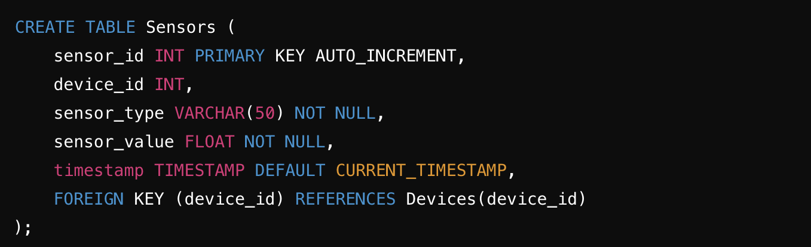

# Learning journal
02.09.2024 Started studying, got git working. Cloned repository to vscode.
04.09.2024 I bought my kit and learned how to solder. Learned different types of components that I will be working with. Choose blueprint smart clock. Connected Arduino IDE. Got blinking on my microcontroller working did all the tests. Got all the needed components to start working on my project for example RFID.
05.09.2024 Connected docker with my project.  
16.09.2024 MySQL Workbench connected and understood how to work with it. 
16.09.2024 Learned laser cuttin and how to work with the machine, how to choose power, speed and how to put picture or design of the piece that I'm going to be cutting. 
19.09.2024 Portfolio running locally on computer
20.09.2024 Working on my database design and learning about the components that I will be using for my project. 
29.09.2024 I watched few youtube videos on how to connect everything in fritzing. Almost done with connecting everything in fritzing but not completely sure if everything is working. 
30.09.2024 
Today, I began my project with the WeMos D1 Mini and a 16x2 I2C LCD. The goal was to connect the LCD to the WeMos and display the message "Hello, World!". I gathered all necessary components: the WeMos board, the LCD, jumper wires, and a breadboard.

Soldering the LCD
Before making connections, I soldered the I2C module onto the back of the LCD. I ensured the solder joints were smooth to prevent any connectivity issues. This involved carefully heating the soldering iron and applying solder to each pin on the I2C module.

Identifying Pin Connections
Next, I identified the pinouts of both the WeMos D1 Mini and the LCD. The WeMos has specific pins for SDA and SCL, which I would use for I2C communication. The LCD required power (VCC), ground (GND), and the two I2C pins.
Wiring the Connections
I connected the LCD to the WeMos as follows:
VCC (LCD) to 5V (WeMos)
GND (LCD) to GND (WeMos)
SDA (LCD) to D2 (WeMos)
SCL (LCD) to D1 (WeMos)

2.10.2024
Uploading the I2C Scanner Code
To verify that the LCD was properly connected, I uploaded an I2C scanner sketch to the WeMos. This code scans for any connected I2C devices and prints their addresses to the Serial Monitor.

Serial Monitor Check
After uploading the I2C scanner code, I opened the Serial Monitor and set the baud rate to 9600. The output confirmed that my LCD was detected at address 0x27.

Next, I wrote a simple Arduino sketch to display "Hello, World!" on the LCD. I included the Wire and LiquidCrystal_I2C libraries in the code and initialized the LCD with the detected I2C address.

Uploading the Display Code
After writing the code, I uploaded it to the WeMos. Upon successful upload, the LCD displayed the message "Hello, World!" on the first row.

Setting Up Docker and MySQL
With the hardware setup complete, I shifted focus to software. I set up Docker and pulled the MySQL image to create a database environment for my project.

Starting MySQL Container
I started a MySQL container using the following command:
docker run --name my-mysql -e MYSQL_ROOT_PASSWORD=root -d mysql:latest

Accessing phpMyAdmin
Next, I installed and configured phpMyAdmin to manage my MySQL database through a web interface. I connected it to my running MySQL container.

Creating Database Tables
I proceeded to create the necessary tables in my MySQL database using SQL queries.
Creating Devices Table
I executed the following query to create the Devices table:

Creating Sensors Table
Next, I created the Sensors table with this query:
Verifying Table Creation

After executing the table creation queries, I verified their creation in phpMyAdmin. All tables were created successfully, and I could see them listed in the database.

Creating Outputs Table
I created the Outputs table:

Creating StatusMessages Table
Finally, I created the StatusMessages table with the following query:

02.10.2024
Testing Database Queries
I tested some basic queries to insert data into these tables. However, I encountered a message stating "MySQL returned an empty result set." This indicated that my queries were not inserting data as expected.

Debugging Insertion Queries
I reviewed my insertion queries to ensure they were correctly formatted and that the necessary data was provided. I also checked for any foreign key constraint issues.

Conclusion and Next Steps
With the LCD working and the database set up, I plan to continue developing my project by integrating sensor readings and sending status messages from the WeMos to the MySQL database. This will allow me to monitor the status of my devices effectively.

Created the project environment and installed necessary libraries, including LiquidCrystal_I2C for the LCD display and DHT for handling the KY-015 humidity/temperature sensor. Initialized the pin assignments for all components, including setting up I2C for the LCD, a data pin for KY-015, and an analog pin for the KY-018 photoresistor.

Wired KY-015 to the WeMos and successfully retrieved basic sensor readings.
KY-015 was wired with its data pin connected to D5. VCC and GND were connected to the respective pins. The DHT library was initialized to begin reading temperature and humidity values. Initial tests show that data is being correctly retrieved and displayed via the serial monitor.

Connected the LCD screen via I2C interface and confirmed proper initialization.
Wired the LCD to the WeMos using the I2C interface. SDA was connected to D1 and SCL to D2. Initialized the LiquidCrystal_I2C library and confirmed that the display is working by printing 'Hello World!' on the screen. The screen is functional, and I will now work on displaying sensor data.

Wired the KY-018 photoresistor to the A0 analog pin and verified data retrieval.
The KY-018 photoresistor was connected to the analog pin A0 to detect ambient light levels. Initial tests show that the analog values are being correctly read by the WeMos and printed to the serial monitor. These readings will be used to adjust the brightness of the LCD display.

Printed static 'Temperature' and 'Humidity' labels on the LCD screen.

Description: The LCD screen now displays the static labels 'Temperature' and 'Humidity.' The first step toward displaying dynamic data has been completed. The next phase involves integrating the sensor data with these labels.

Displayed Real-Time Temperature on LCD Screen

Added functionality to dynamically display temperature data on the LCD screen.
The LCD now dynamically displays temperature readings from the KY-015 sensor on the first line. The values are updated every second, reflecting real-time environmental conditions.

Successfully integrated real-time humidity data into the second line of the LCD.

The humidity readings from the KY-015 are now displayed in real-time on the second line of the LCD. Both temperature and humidity data are updating every second, and the display refreshes smoothly.

Added brightness control to the LCD using the KY-018 photoresistor.

The LCD backlight brightness is now controlled dynamically based on ambient light readings from the KY-018 photoresistor. When the environment is brighter, the LCD dims, and when it’s darker, the LCD brightens for better visibility.

Implemented smoothing for photoresistor readings to create smoother brightness transitions."

Description: By averaging multiple photoresistor readings over time, the brightness transitions are now much smoother, reducing flickering and creating a more polished appearance.

Added error handling for failed readings from the KY-015 sensor.

The code now includes error detection for when the KY-015 sensor fails to respond. If there’s an issue, the LCD will display 'Sensor Error' instead of showing blank or frozen values.

Optimized LCD Display Format

Message: Formatted LCD display with units of measurement for better readability.

Added the degree symbol (°C) for temperature and percentage (%) for humidity. The values are now more user-friendly and intuitive

Tested the system over an extended period to ensure stability of sensor readings and display.

Performed extended tests to verify that all components (LCD, KY-015, KY-018) work reliably over time. No significant issues were found.

Completed final testing to ensure the system is error-free and ready for deployment.

Created a wiring diagram and saved it as a reference for future use.

Description: "Generated a wiring diagram showing how each component is connected to the WeMos. The diagram has been saved as part of the project documentation.

Ran the final round of testing, and all sensors, the LCD, and the WeMos are operating without errors. The system is stable and fully functional.

Documented the final setup of the system, including pin connections and key configurations.

Wrote detailed documentation describing the final setup, including the connections for the LCD, KY-015, and KY-018. This will serve as a future reference for troubleshooting or further modifications.

Rearranged pin layout for cleaner wiring and better cable management.
Changed the pin layout slightly to make the wiring cleaner and easier to manage. This makes future modifications or repairs simpler.

Finalized the circuit design and completed thorough testing.

The circuit design has been finalized, and all tests have passed. The system is now fully functional, with real-time humidity, temperature, and brightness readings displayed accurately on the LCD.

Assigned GPIO pins for two LEDs and the push button.
Mapped GPIO pins for two LEDs and the push button in the code.

Wired the first LED to GPIO pin D3.
Connected the anode of the first LED to D3 with a current-limiting resistor.

Wired the second LED to GPIO pin D4.
Second LED connected to D4, completing the basic circuit.

Connected push button to GPIO pin D5 and ground."

Description: "Push button wired for input, with one side connected to D5 and the other to ground."

Tested LED Circuit Functionality
Tested both LEDs for basic functionality.

Ensured that both LEDs turn on when set HIGH in code

Added Push Button Input Logic
Implemented logic to detect push button press.
Added code to detect when the push button is pressed.

Controlled LED with Push Button Press
Linked push button press to LED control.
First LED turns on/off based on push button press.

Enabled toggling both LEDs using the push button.
Toggling between the two LEDs with consecutive button presses.

Final Testing of Push Button and LEDs
Completed final testing for LEDs and push button.
Verified the entire setup works as intended, with both LEDs toggling based on push button input.

Your learning journal can be seen as a diary of your learning process. It is a place where you can reflect on your learning, and where you can keep track of your progress. It is also a place where you can keep track of your questions, and where you can write down your answers to those questions.

So for example when you receive feedback on your project, you can write down the feedback and your reflection on it in your learning journal. You can also write down what you have learned from the feedback, and how you will apply it in your project.

